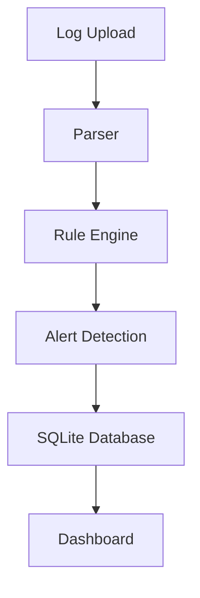

# SentinelLite

A lightweight SIEM-inspired cybersecurity platform for authentication log analysis and suspicious activity detection.

## Features

- Authentication log ingestion
- Brute-force detection
- Persistent alert storage
- Upload audit trail
- Dashboard interface
- Dockerized deployment
- SQLite-backed event storage
- Modular detection rule engine

---

## Tech Stack

- Python 3.12
- FastAPI
- SQLite
- Docker
- HTML/CSS

---

## Architecture



---

## Detection Rules

### Brute Force Detection

Triggers when repeated failed authentication attempts are detected from the same source.

---

## Run Locally

```bash
docker compose up --build
```

Open:

http://localhost:8000

---

## Dashboard Pages

- Home
- Alerts
- Upload History

---

## Future Improvements

- Suspicious login hour detection
- Chart analytics
- MITRE ATT&CK mapping
- PostgreSQL migration

---

## Project Purpose

SentinelLite demonstrates lightweight SIEM design principles including:

- log normalization
- rule-based detection
- event persistence
- alert visualization
- modular analytics architecture